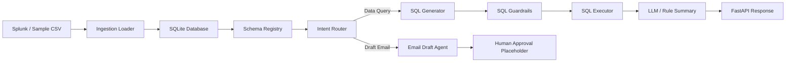

# SQL-RAG Splunk Project

This is a minimal end-to-end SQL-RAG application for one Splunk dataset/index.

The example dataset is `vulnerability_events`, but the same pattern can be scaled to multiple Splunk indexes/datasets by adding:

1. A new table DDL
2. A schema entry in `config/dataset_registry.yaml`
3. A loader/search definition
4. Business rules and prompts

The application supports:

- Natural language query over Splunk-like data
- Intent routing
- Text-to-SQL generation
- SQL validation and guardrails
- SQL execution
- Result summarization
- Email draft generation
- Human approval placeholder for actions

---

## Architecture



---

## Quick Start

### 1. Create virtual environment

```bash
python -m venv .venv
source .venv/bin/activate
```

On Windows:

```bash
.venv\Scripts\activate
```

### 2. Install dependencies

```bash
pip install -r requirements.txt
```

### 3. Create local database and load sample data

```bash
python scripts/init_db.py
```

### 4. Start FastAPI

```bash
uvicorn app.main:app --reload --port 8000
```

### 5. Test health endpoint

Open:

```text
http://localhost:8000/health
```

### 6. Ask a SQL-RAG question

```bash
curl -X POST "http://localhost:8000/query" \
-H "Content-Type: application/json" \
-d '{"question":"Show critical vulnerabilities overdue by more than 30 days"}'
```

### 7. Draft an email

```bash
curl -X POST "http://localhost:8000/query" \
-H "Content-Type: application/json" \
-d '{"question":"Draft email to ITSO owners for critical vulnerabilities breached more than 30 days"}'
```

---

## Example Questions

```text
Show top 5 applications with highest open critical vulnerabilities
```

```text
Which ITSO has the highest breached vulnerabilities?
```

```text
Show critical vulnerabilities overdue by more than 30 days
```

```text
Draft email to owners for overdue critical vulnerabilities
```

```text
Give executive summary of vulnerability risk
```

---

## Scaling to More Splunk Indexes

To add another Splunk index, for example `incident_events`:

1. Add DDL:
   - `sql/ddl/create_incident_table.sql`

2. Add schema in:
   - `config/dataset_registry.yaml`

3. Add ingestion loader:
   - `app/ingestion/incident_loader.py`

4. Add business rules:
   - `app/agents/sql_generator_agent.py`

5. Add test:
   - `tests/test_incident_query.py`

Recommended future tables:

| Splunk Source | SQL Table |
|---|---|
| vulnerability index | vulnerability_events |
| incident index | incident_events |
| change index | change_events |
| CMDB / inventory | server_inventory |
| ownership lookup | service_ownership |
| risk appetite lookup | risk_thresholds |

---

## Security Notes

This project uses a safe SQL layer:

- Only `SELECT` is allowed
- Dangerous SQL keywords are blocked
- Unknown tables are blocked
- Row limit is enforced
- LLM output is never executed directly without validation

For bank production use:

- Use internal LLM only
- Use Vault for secrets
- Use PostgreSQL instead of SQLite
- Apply RBAC
- Add audit logging
- Add human approval before email/Jira actions
- Avoid sending raw confidential data outside the bank network

---

## Production Upgrade Path

Prototype:

```text
FastAPI + SQLite + Rule-based SQL generator
```

Bank-ready version:

```text
FastAPI + PostgreSQL + Internal LLM + SQL Validator + RBAC + Audit Logs + Vault + Kubernetes
```
